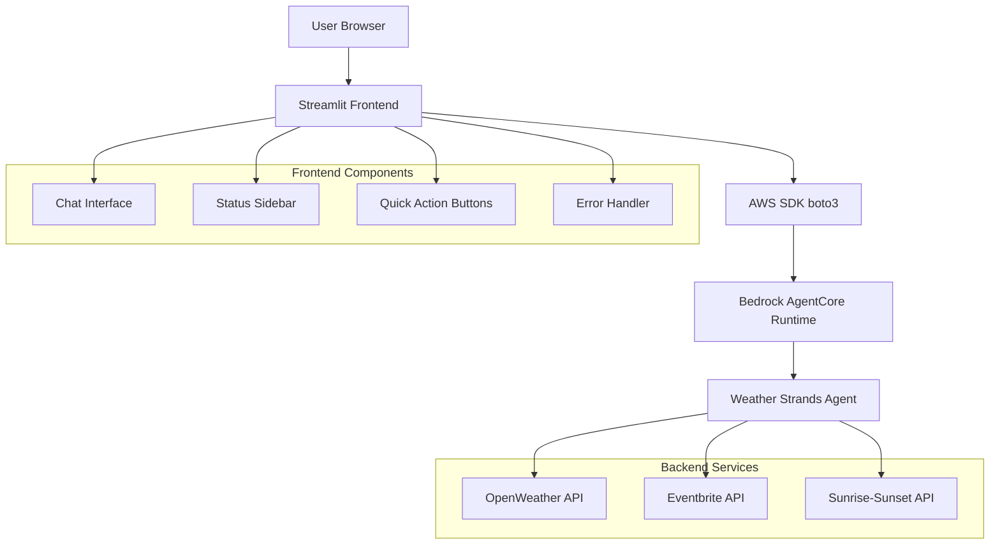

# Design Document

## Overview

This design outlines the development of a Streamlit-based frontend application for the Weather Strands Agent deployed on Amazon Bedrock's AgentCore Runtime. The application provides a conversational chat interface that allows users to interact with the weather agent through natural language queries, supporting weather information, event discovery, and sunrise/sunset times with proper error handling and user experience features.

## Architecture

### High-Level Architecture



### Component Architecture

The Streamlit frontend consists of:

1. **Main Chat Interface**: Core conversational UI using Streamlit's chat components
2. **WeatherAgentClient**: AWS SDK wrapper for AgentCore Runtime integration
3. **Sidebar Status Panel**: Connection status, configuration info, and controls
4. **Quick Action Buttons**: Pre-defined queries for common cities
5. **Error Handling System**: Comprehensive error management and user feedback
6. **State Management**: Streamlit session state for chat history and UI state

## Components and Interfaces

### Main Application (`streamlit_app.py`)

**Core Structure:**
```python
import streamlit as st
import boto3
import json
from datetime import datetime
from botocore.exceptions import ClientError

# Page configuration
st.set_page_config(
    page_title="🧠 Weather Agent - 智能天氣助手",
    page_icon="🧠",
    layout="wide",
    initial_sidebar_state="expanded"
)

# Agent configuration constants
AGENT_ARN = 'arn:aws:bedrock-agentcore:us-east-1:318747609494:runtime/weather_agent-E87KKC6j1D'
AWS_REGION = 'us-east-1'
```

### WeatherAgentClient Class

**Purpose**: Encapsulate AWS SDK interactions and error handling

**Key Methods:**
```python
class WeatherAgentClient:
    def __init__(self, region_name='us-east-1'):
        # Initialize boto3 client with workshop-profile
        session = boto3.Session(profile_name='workshop-profile')
        self.client = session.client('bedrock-agentcore', region_name=region_name)
    
    def query_weather(self, prompt: str) -> dict:
        # Invoke agent with comprehensive error handling
        # Return standardized response format
    
    def test_connection(self) -> dict:
        # Test connectivity with simple query
```

**Response Format:**
```python
{
    'success': bool,
    'data': str,  # Agent response text
    'metadata': {
        'request_id': str,
        'http_status': int,
        'timestamp': str
    },
    'error': {  # Only present if success=False
        'type': str,
        'code': str,
        'message': str,
        'retryable': bool
    }
}
```

### Chat Interface Components

**Message Rendering:**
```python
def render_chat_message(role: str, content: str, timestamp: str = None):
    with st.chat_message(role):
        if role == "user":
            st.markdown(f"**您:** {content}")
        else:
            st.markdown(f"**🧠 天氣助手:**")
            st.markdown(content)  # Proper markdown rendering for weather data
        
        if timestamp:
            st.caption(f"時間: {timestamp}")
```

**Input Processing:**
```python
def process_user_input(user_input: str):
    # Add user message to session state
    # Show loading spinner
    # Call weather agent
    # Handle response/errors
    # Update UI state
    # Force rerun
```

### Sidebar Status Panel

**Components:**
- Connection status indicator (green/red)
- Last update timestamp
- Configuration information (AWS region, Agent ID)
- Clear conversation button
- Test connection button

**Status Display Logic:**
```python
def render_sidebar():
    with st.sidebar:
        # Connection status
        if client.connection_status == "connected":
            st.success("🟢 連線正常")
        else:
            st.error("🔴 連線錯誤")
        
        # Configuration info
        st.text(f"AWS Region: {AWS_REGION}")
        st.text(f"Agent ID: weather_agent-E87KKC6j1D")
        
        # Action buttons
        if st.button("🗑️ 清除對話"):
            st.session_state.messages = []
            st.rerun()
```

### Quick Action Buttons

**Implementation:**
```python
col1, col2, col3, col4 = st.columns(4)

with col1:
    if st.button("🌤️ 台北天氣", use_container_width=True):
        if not st.session_state.loading:
            process_user_input("台北今天天氣如何？")
```

**Supported Cities:**
- 台北 (Taipei)
- 東京 (Tokyo) 
- 倫敦 (London)
- 紐約 (New York)

## Data Models

### Session State Schema

```python
st.session_state = {
    'messages': [
        {
            'role': 'user' | 'assistant',
            'content': str,
            'timestamp': str,
            'metadata': dict  # Optional, for assistant messages
        }
    ],
    'weather_client': WeatherAgentClient,
    'loading': bool
}
```

### Agent Request/Response Format

**Request Payload:**
```json
{
    "prompt": "台北今天天氣如何？"
}
```

**Agent Response:**
```json
{
    "result": "🌤️ **台北天氣概況：晴，少雲**\n- **溫度：32.1°C**\n- **體感溫度：35.2°C**\n- **濕度：68%**\n\n☀️ **今日建議：**\n天氣炎熱，建議穿著輕便透氣的衣物，多補充水分。"
}
```

## Error Handling

### Error Categories and Handling

**1. AWS Authentication Errors**
```python
# ClientError with AccessDeniedException
error_msg = "❌ AWS 認證失敗\n\n請檢查：\n- workshop-profile 配置\n- IAM 權限設定\n- AWS 憑證有效性"
```

**2. Agent Runtime Errors**
```python
# ClientError with various codes
error_types = {
    'ThrottlingException': '請求過於頻繁，請稍後重試',
    'ValidationException': '請求格式錯誤',
    'ServiceUnavailableException': '服務暫時不可用，請稍後重試'
}
```

**3. Network and Connectivity Errors**
```python
# Connection timeouts, DNS issues
error_msg = "❌ 網路連線問題\n\n建議：\n- 檢查網路連線\n- 確認 AWS 服務狀態\n- 稍後重試"
```

**4. JSON Parsing Errors**
```python
# Malformed agent responses
error_msg = "❌ 回應格式錯誤\n\n系統無法解析 Agent 回應，請重試或聯繫管理員"
```

### Error Display Strategy

**User-Friendly Messages:**
- Clear problem description in Chinese
- Specific troubleshooting steps
- Indication of whether retry is recommended
- Visual error indicators (❌ emoji, red styling)

**Error Recovery:**
- Automatic retry for transient errors
- Graceful degradation for partial failures
- Clear recovery instructions for user actions

## Testing Strategy

### Local Development Testing

**1. Environment Setup Verification**
```bash
# Activate uv virtual environment
source .venv/bin/activate

# Install dependencies
uv pip install streamlit boto3

# Verify AWS profile
aws sts get-caller-identity --profile workshop-profile
```

**2. Component Testing**
- WeatherAgentClient initialization and connection
- Individual query types (weather, events, sun times)
- Error handling scenarios
- UI component rendering

**3. Integration Testing**
- End-to-end user workflows
- Multiple query types in sequence
- Error recovery scenarios
- State management across interactions

### User Experience Testing

**Test Scenarios:**
1. **Basic Weather Queries**: "台北今天天氣如何？"
2. **Event Queries**: "紐約有什麼活動？"
3. **Sun Time Queries**: "東京今天日出時間？"
4. **Combined Queries**: "告訴我倫敦的天氣和活動"
5. **Error Scenarios**: Invalid credentials, network issues
6. **UI Interactions**: Quick buttons, clear conversation, sidebar functions

### Performance Testing

**Metrics to Monitor:**
- Response time for agent queries
- UI responsiveness during loading
- Memory usage with long chat histories
- Error recovery time

## User Interface Design

### Layout Structure

**Main Layout:**
```
┌─────────────────┬─────────────────────────────────┐
│                 │                                 │
│   Sidebar       │         Main Content            │
│   - Status      │   - Title & Description         │
│   - Config      │   - Example Queries             │
│   - Controls    │   - Chat Messages               │
│                 │   - Input Box                   │
│                 │   - Quick Action Buttons        │
│                 │                                 │
└─────────────────┴─────────────────────────────────┘
```

### Visual Design Elements

**Color Scheme:**
- Success: Green (🟢) for connected status
- Error: Red (🔴) for error states  
- Loading: Blue spinner for processing
- Neutral: Gray for timestamps and metadata

**Typography:**
- **Bold** for important information (temperatures, status)
- Regular text for descriptions
- `Code style` for technical details
- Emoji integration for visual appeal

**Interactive Elements:**
- Buttons with full-width styling
- Hover effects on interactive elements
- Loading states with spinners
- Disabled states during processing

### Responsive Design

**Mobile Considerations:**
- Sidebar collapses on smaller screens
- Button layout adapts to screen width
- Chat messages remain readable
- Touch-friendly button sizes

**Desktop Optimization:**
- Wide layout utilization
- Sidebar always visible
- Efficient use of horizontal space
- Keyboard shortcuts support

## Implementation Approach

### Phase 1: Core Infrastructure
1. Set up Streamlit application structure
2. Implement WeatherAgentClient with AWS SDK integration
3. Create basic chat interface with session state management
4. Implement error handling framework

### Phase 2: User Interface Development
1. Design and implement sidebar status panel
2. Create chat message rendering system
3. Add quick action buttons for common queries
4. Implement loading states and user feedback

### Phase 3: Enhanced Features
1. Add example queries and help documentation
2. Implement comprehensive error messages
3. Add connection testing and diagnostics
4. Optimize user experience and responsiveness

### Phase 4: Testing and Refinement
1. Test all user workflows and error scenarios
2. Verify AWS integration and authentication
3. Optimize performance and responsiveness
4. Clean up development artifacts

## Security Considerations

### AWS Credentials Management
- Use workshop-profile for consistent authentication
- No hardcoded credentials in source code
- Proper IAM permissions for AgentCore access
- Session-based credential handling

### Data Privacy
- No persistent storage of user queries
- Session-only chat history
- No logging of sensitive information
- Secure transmission to AWS services

### Error Information Disclosure
- Generic error messages for security issues
- No exposure of internal system details
- Safe error logging practices
- User-friendly error descriptions

## Deployment and Configuration

### Environment Requirements
- Python 3.12 with uv package manager
- Streamlit framework
- boto3 AWS SDK
- Valid AWS credentials with workshop-profile

### Configuration Management
- Agent ARN and region as constants
- AWS profile configuration
- Streamlit page configuration
- Error message templates

### Runtime Dependencies
- Active internet connection for AWS API calls
- Valid AWS credentials and permissions
- AgentCore Runtime availability
- Proper network configuration for AWS access

This design ensures a robust, user-friendly Streamlit frontend that effectively integrates with the deployed Weather Strands Agent while providing excellent error handling and user experience.