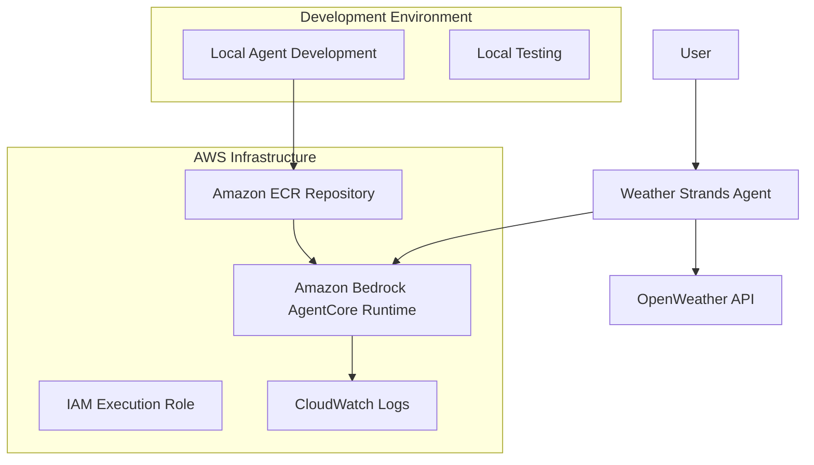

# Design Document

## Overview

This design outlines the development and deployment of a weather Strands Agent that integrates with the OpenWeather API and deploys to Amazon Bedrock's AgentCore Runtime. The solution leverages Strands Agent's model-driven approach with built-in HTTP request capabilities to provide users with conversational weather information queries.

## Architecture

### High-Level Architecture



### Component Architecture

The weather agent consists of:

1. **Strands Agent Core**: Main agent framework handling conversation flow
2. **HTTP Request Tool**: Built-in tool from strands-agents-tools for API calls
3. **OpenWeather Integration**: API integration for weather data retrieval
4. **AgentCore Runtime**: AWS-managed execution environment

## Components and Interfaces

### Weather Agent (`weather_agent.py`)

**Core Components:**
- `BedrockAgentCoreApp`: Main application wrapper for AgentCore compatibility
- `Agent`: Strands Agent instance with HTTP request capabilities
- `@app.entrypoint`: Entry point function for handling user requests

**Key Interfaces:**
```python
from bedrock_agentcore import BedrockAgentCoreApp
from strands import Agent
from strands_tools import http_request

app = BedrockAgentCoreApp()
agent = Agent(
    tools=[http_request],
    prompt="You are a helpful weather assistant..."
)

@app.entrypoint
def invoke(payload):
    user_message = payload.get("prompt", "Hello! How can I help you today?")
    result = agent(user_message)
    return {"result": result.message}
```

### OpenWeather API Integration

**API Endpoint:** `http://api.openweathermap.org/data/2.5/weather`

**Parameters:**
- `q`: City name (user-provided)
- `appid`: API key (from environment variable)
- `units`: metric (for Celsius temperatures)

**Response Format:**
```json
{
  "weather": [{"main": "Clear", "description": "clear sky"}],
  "main": {"temp": 22.5, "feels_like": 21.8, "humidity": 60},
  "name": "London",
  "sys": {"country": "GB"}
}
```

### AgentCore Runtime Integration

**Deployment Components:**
- **Container Image**: Built automatically by AgentCore starter toolkit
- **IAM Role**: Auto-generated with necessary permissions
- **ECR Repository**: Container registry for agent image
- **CloudWatch Logs**: Centralized logging for monitoring

## Data Models

### Request Payload
```python
{
    "prompt": str  # User's weather query (e.g., "What's the weather in London?")
}
```

### Response Model
```python
{
    "result": str  # Formatted weather information response
}
```

### Weather Data Processing
The agent will process OpenWeather API responses and format them into user-friendly messages including:
- Current temperature and "feels like" temperature
- Weather conditions and description
- Humidity levels
- City and country information

## Error Handling

### API Error Scenarios
1. **Invalid City Name**: Handle 404 responses from OpenWeather API
2. **API Key Issues**: Handle 401 unauthorized responses
3. **Network Failures**: Handle connection timeouts and network errors
4. **Rate Limiting**: Handle 429 too many requests responses

### Agent Error Handling
- Graceful degradation when API is unavailable
- User-friendly error messages for common issues
- Fallback responses when weather data cannot be retrieved

### AgentCore Runtime Error Handling
- CloudWatch logging for debugging deployment issues
- Proper HTTP status codes for different error scenarios
- Structured error responses for programmatic access

## Testing Strategy

### Local Development Testing
1. **Unit Testing**: Test individual components (minimal as per requirements)
2. **Integration Testing**: Test OpenWeather API integration locally
3. **Local Agent Testing**: Use `python weather_agent.py` and curl commands

### Deployment Testing
1. **AgentCore Invoke Testing**: Use `agentcore invoke` command
2. **Programmatic Testing**: Test via AWS SDK InvokeAgentRuntime
3. **End-to-End Testing**: Verify complete user workflow

### Test Scenarios
- Valid city weather requests
- Invalid city name handling
- API key validation
- Network connectivity issues
- Large city name variations (case sensitivity, special characters)

## Deployment Architecture

### Development Environment Setup
- Python 3.10+ with uv virtual environment
- AWS CLI configured with workshop-profile
- Required packages: bedrock-agentcore, strands-agents, strands-agents-tools

### AgentCore Deployment Process
1. **Configure**: `agentcore configure -e weather_agent.py -r us-east-1`
2. **Launch**: `agentcore launch` (creates ECR, IAM role, deploys to runtime)
3. **Test**: `agentcore invoke '{"prompt": "weather in New York"}'`

### Infrastructure Components
- **Region**: us-east-1 (as specified in requirements)
- **Container Registry**: Amazon ECR with auto-generated repository
- **Execution Role**: IAM role with AgentCore runtime permissions
- **Runtime Environment**: Amazon Bedrock AgentCore Runtime with ARM64 containers
- **Logging**: CloudWatch Logs with structured logging

### Security Considerations
- API key stored as environment variable in MCP configuration
- IAM role with least-privilege permissions
- Secure container execution in isolated AgentCore runtime
- No sensitive data logging in CloudWatch

## Implementation Approach

### Phase 1: Local Development
1. Create weather_agent.py with basic Strands Agent setup
2. Integrate http_request tool for OpenWeather API calls
3. Implement weather data parsing and formatting
4. Test locally using curl commands

### Phase 2: AgentCore Deployment
1. Configure AgentCore deployment settings
2. Deploy to AgentCore Runtime using starter toolkit
3. Test deployed agent using agentcore invoke
4. Verify programmatic access via AWS SDK

### Phase 3: Documentation
1. Create API documentation with infrastructure details
2. Document ARN, IAM role, and ECR repository information
3. Provide integration examples for frontend development
4. Clean up any temporary test files

This design ensures a simple, effective weather agent that leverages Strands Agent's capabilities while meeting all deployment and functionality requirements.